# Assignment 1: Object Classification with TensorFlow!

- Anuj Pahuja (apahuja)

Scripts corresponding to different questions are mentioned along with the answers to the questions. Execution commands for different scripts - 
1. `python 02_pascal.py`  
2. `python 03_pascal_caffenet.py`  
3. `python 04_pascal_vgg_scratch.py`  
4. `python 04_pascal_vgg_finetune.py`  
5. `python visualize_caffenet.py --ckpt <ckpt>` (Reported on 5, 10, 20, and 30)
6. `python nn_caffenet.py` and `python nn_vgg.py`
7. `python tsne_caffenet.py`
8. `python eval_caffenet.py` and `python eval_vgg_ft.py`
9. `python 06_pascal_caffenet_mixup.py` and `06_pascal_vgg_finetune_mixup.py`

## Task 0: Fashion MNIST classification in TensorFlow (5 points)

#### Q 0.1: Both scripts use the same neural network model, how many trainable parameters does each layer have?

**Answer**  
Total trainable parameters - 3,274,634  
Conv1 - 832  
Pool1 - 0  
Conv2 - 51,264  
Pool2 - 0  
FC1 - 3,212,288  
Dropout - 0  
FC2 - 10,250  

#### Q 0.2: Show the loss and accuracy curves for both scripts with the default hyperparameters.

**Answer**  
Script `00_fashion_mnist.py` :

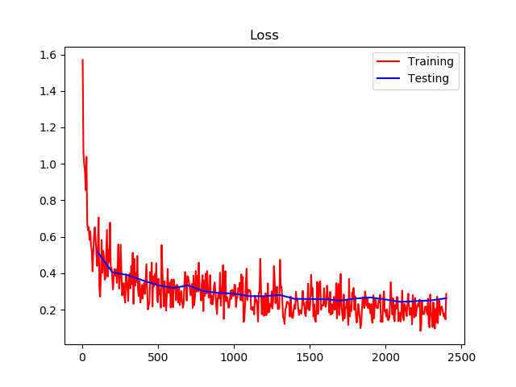
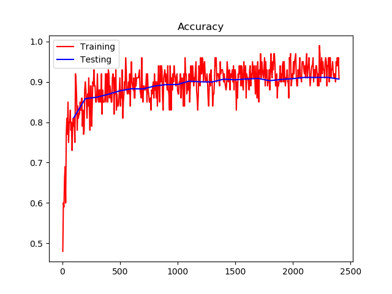

Script `01_fashion_mnist.py` :

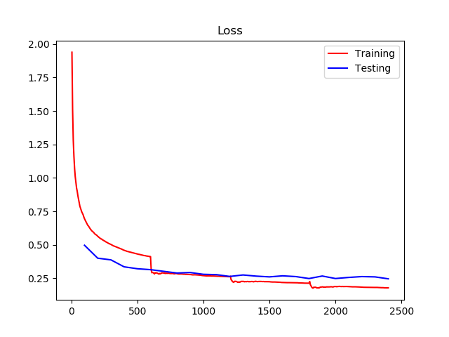
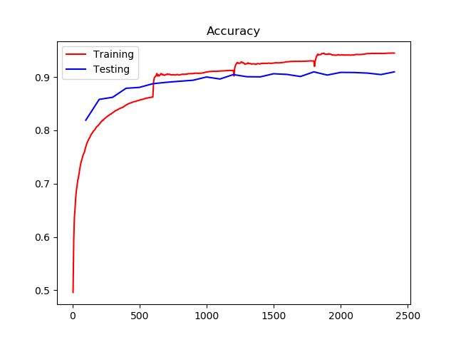

#### Q 0.3: Why do the plots from two scripts look different? Why does the second script show smoother loss? Why are there three jumps in the training curves?

**Answer**  
The plots are different because the first script logs losses and accuracy per batch whereas the second script logs a running average for loss and acuuracy for an epoch. Since batch-wise statistics can be very noisy, we see a noisy curve for the first script whereas the running average smoothens the loss curve in the other case. The three jumps are caused on completion of every epoch. Since the loss would be high initially for an epoch, the running average will be also be affected by it. As soon as we start a new epoch, the previous epoch statistics go away and the curve starts with a loss value that is not affected by the high loss occured in the initial stages of previous epoch, hence the sudden jump.

#### Q 0.4: What happens if you train the network for 10 epochs?

**Answer**  
The networks tend to overfit on the training data as we can see reduction in training loss and increase in training accuracy but no change/increase in test loss and no change/decrease in test accuracy.

Script `00_fashion_mnist.py` :

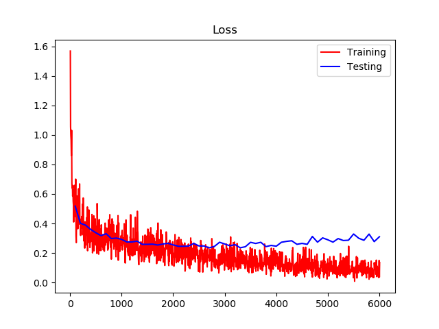
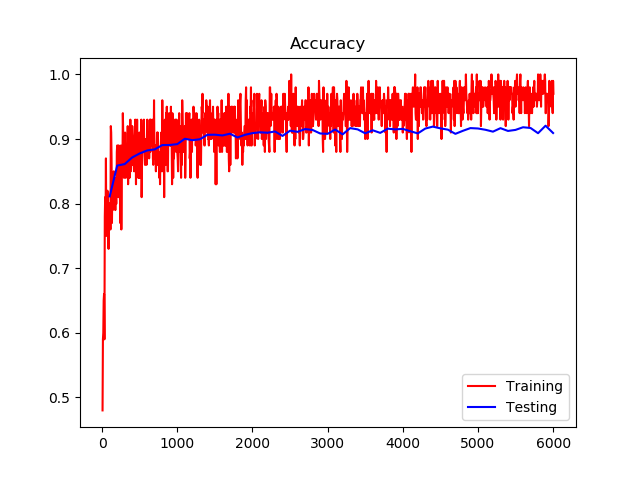

Script `01_fashion_mnist.py` :

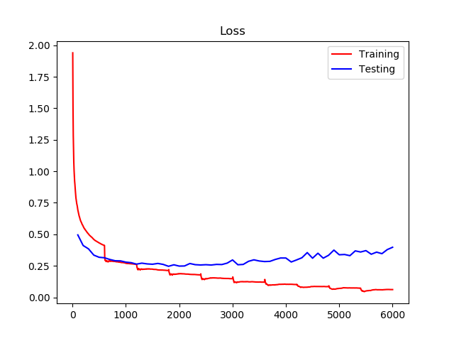
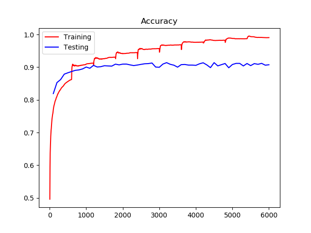

## Task 1: Simple CNN network for PASCAL multi-label classification (20 points)

### 1.1: Write a data loader for PASCAL 2007.

Done in `util.py`.

### 1.2 Data Augmentation and Dataset Generation

Done in `02_pascal.py`.

### 1.3: Modify the Fashion MNIST model to be suitable for multi-label classification.

Done in `02_pascal.py`.

### 1.4 Measure Performance

Implemented in `util.py`.

### 1.5 Setup tensorboard

Done in `02_pascal.py`.

#### Q 1.1 Show clear screenshots of the learning curves of testing MAP and training loss for 5 epochs (batch size=20, learning rate=0.001). Please evaluate your model to calculate the MAP on the testing dataset every 50 iterations.

**Answer**  
Here are the tensorboard plots for test mAP and training loss curve.

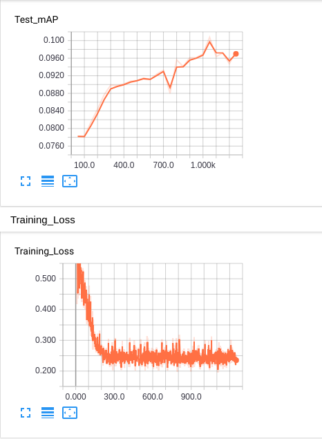

## Task 2: Lets go deeper! CaffeNet for PASCAL classification (20 points)

### 2.1 Build CaffeNet

### 2.2 Setup Solver Hyperparameters

### 2.3 Save the model

**Answer**

Implemented in `03_pascal_caffenet.py`.

#### Q 2.1 Show clear screenshots of testing MAP and training loss for 60 epochs. Please evaluate your model to calculate the MAP on the testing dataset every 250 iterations.

**Answer**

Here are the tensorboard plots for LR, test mAP and training loss curve.

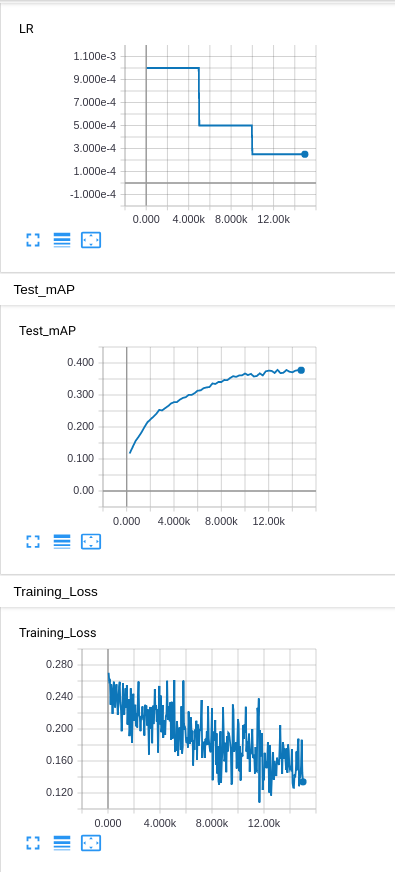

Final mAP - 0.3769

## Task 3: Even deeper! VGG-16 for PASCAL classification (15 points)

### 3.1: Build VGG-16

**Answer**  
Implemented in `04_pascal_vgg_scratch.py`.

### 3.2: Setup TensorBoard

**Answer**  
Implemented in `04_pascal_vgg_scratch.py`.

#### Q 3.1 Add screenshots of training and testing loss, testing MAP curves, learning rate, histograms of gradients and examples of training images from TensorBoard.

**Answer**

Here are the tensorboard plots for LR, test mAP, training loss, histogram of gradients and sample images.

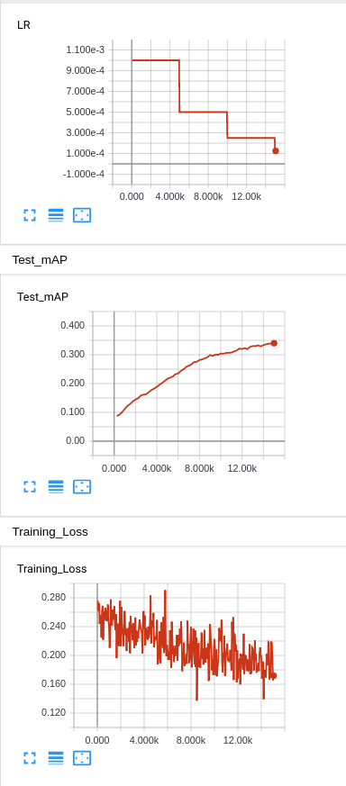
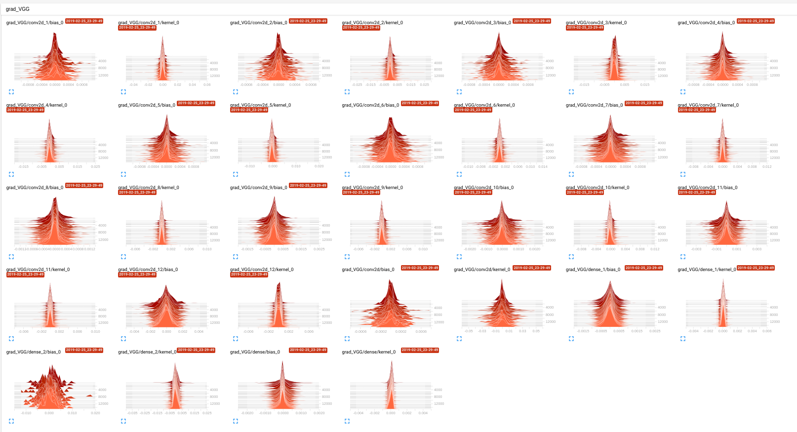
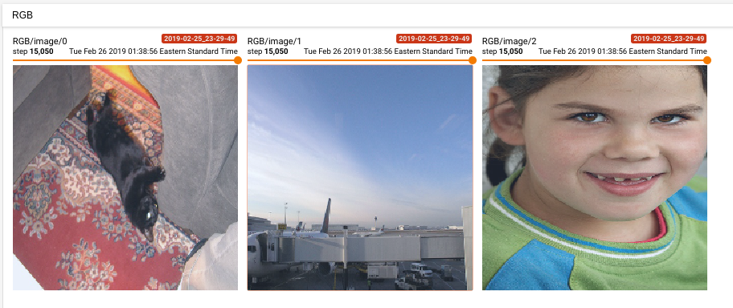

Final mAP - 0.34

## Task 4: Standing on the shoulder of the giants: finetuning from ImageNet (20 points)

### 4.1: Load pre-trained model

**Answer**

Implemented in `05_pascal_vgg_finetune.py`.

#### Q4.1: Use similar hyperparameter setup as in the scratch case, however, let the learning rate start from 0.0001, and decay by 0.5 every 1K iterations. Show the learning curves (training and testing loss, testing MAP) for 10 epochs. Please evaluate your model to calculate the MAP on the testing dataset every 60 iterations.

**Answer**  
Here are the tensorboard plots for LR, test mAP, train and test loss.

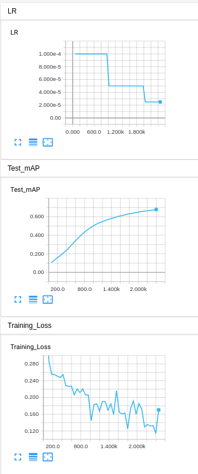

Final mAP - 0.6647

## Task 5: Analysis (20 points)

By now we should have a good idea of training networks from scratch or from pre-trained model, and the relative performance in either scenarios. Needless to say, the performance of these models is way stronger than previous non-deep architectures we used until 2012. However, final performance is not the only metric we care about. It is important to get some intuition of what these models are really learning. Lets try some standard techniques.

#### Q5.1: Conv-1 filters
Extract and compare the conv1 filters from CaffeNet in Task 2, at different stages of the training. Show at least 3 filters.

**Answer**  
Here are the first 16 filters of conv1 visualized after 10, 20, 40 and 60 epochs. The code is implemented in `visualize_caffenet.py`.

**10 epochs**
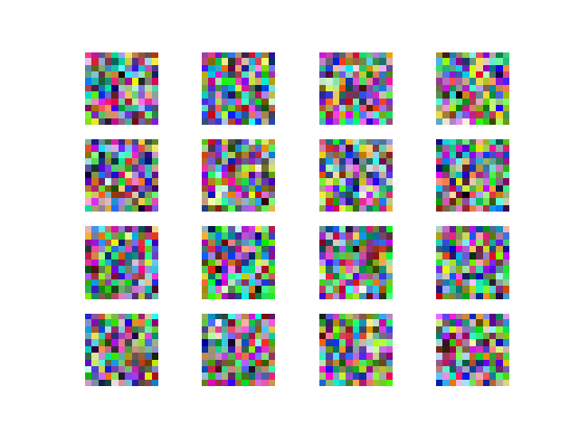

**20 epochs**
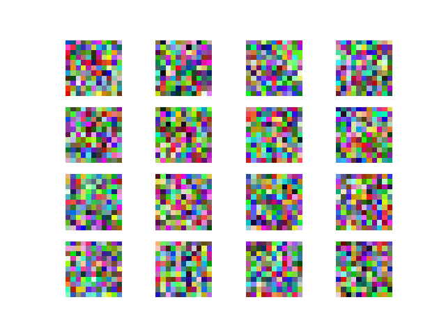

**40 epochs**
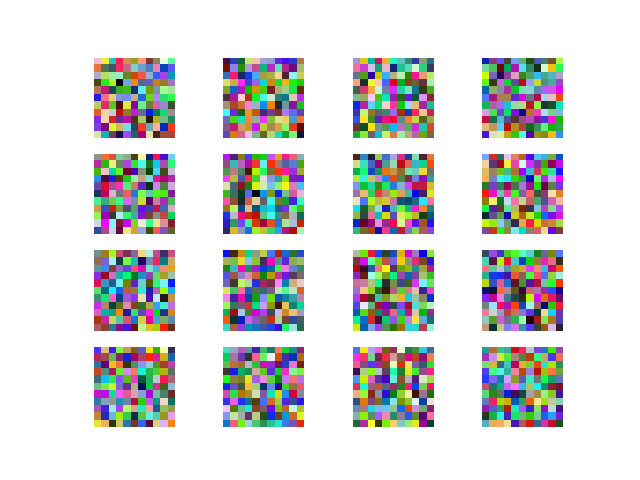

**60 epochs**
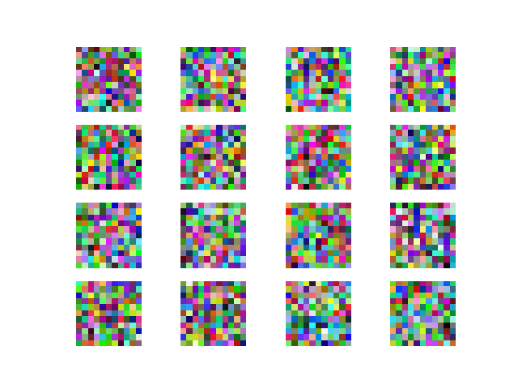

#### Q5.2: Nearest neighbors
Pick 10 images from PASCAL test set from different classes, and compute 4 nearest neighbors of those images over the test set. You should use and compare the following feature representations for the nearest neighbors:

1. pool5 features from the CaffeNet (trained from scratch)
1. fc7 features from the CaffeNet (trained from scratch)
1. pool5 features from the VGG (finetuned from ImageNet)
1. fc7 features from VGG (finetuned from ImageNet)

Show the 10 images you chose and their 4 nearest neighbors for each case.

**Answer**  
The subplots show 5 nearest neighbors per image (first being the image itself).

**Pool5 Nearest Neighbor for CaffeNet**  
Code implemented in `nn_caffenet.py`.

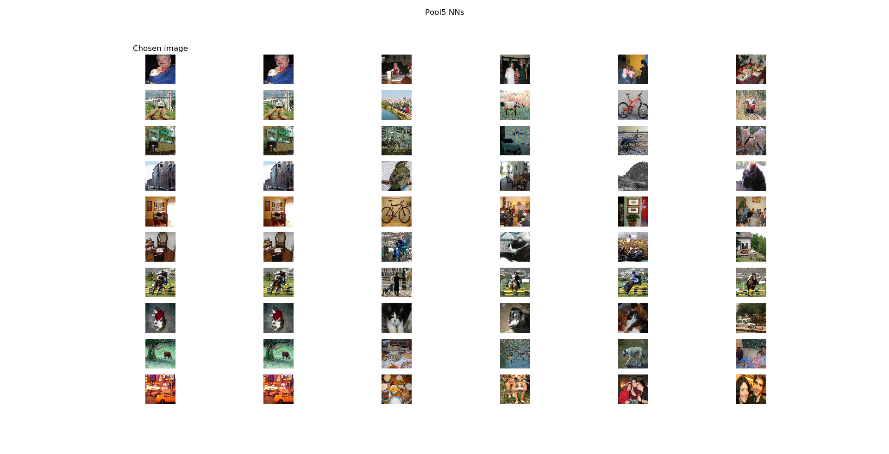

**FC7 Nearest Neighbor for CaffeNet**  
Code implemented in `nn_caffenet.py`.

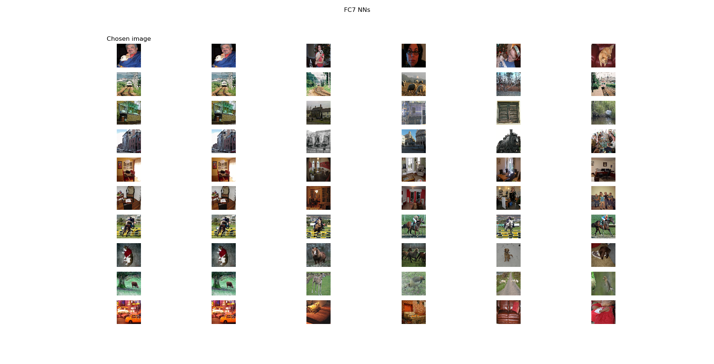

**Pool5 Nearest Neighbor for VGG**  
Code implemented in `nn_vgg.py`.

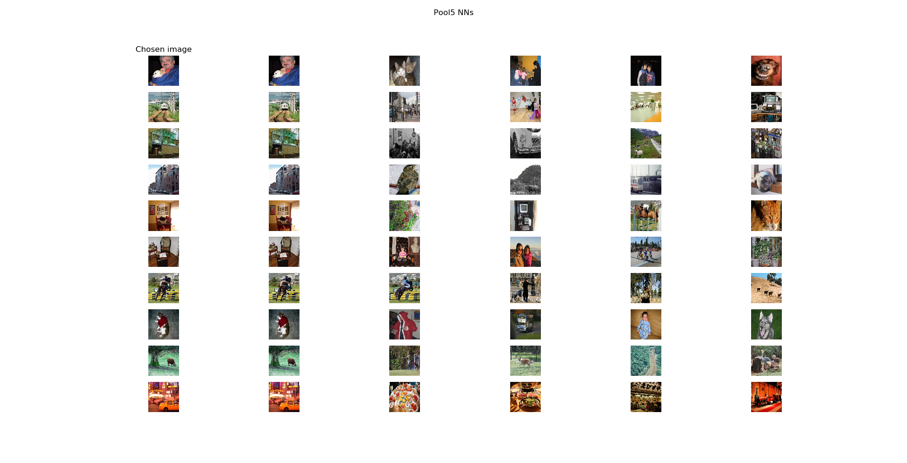

**FC7 Nearest Neighbor for VGG**  
Code implemented in `nn_vgg.py`.

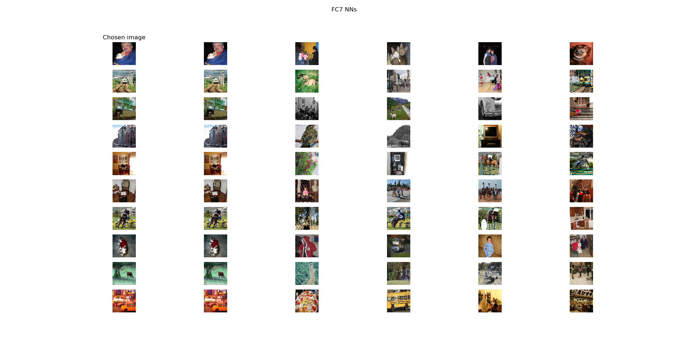

#### Q5.3: t-SNE visualization of intermediate features

Code implemented in `tsne_caffenet.py`.

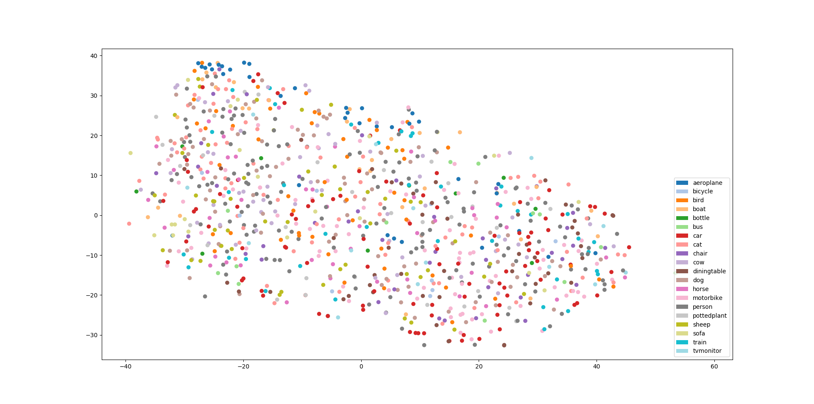

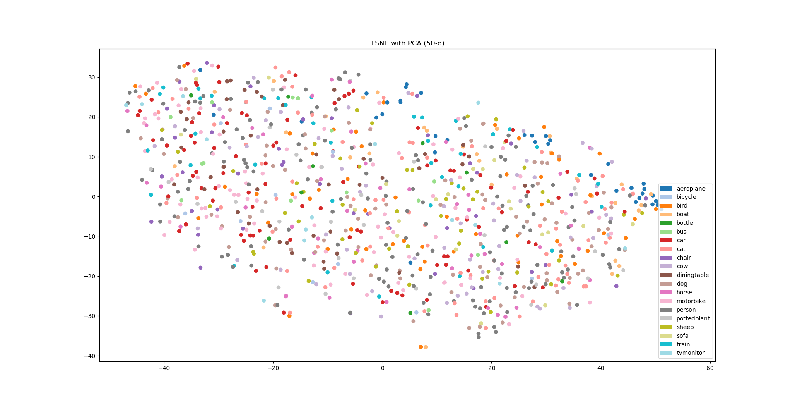

#### Q5.4: Are some classes harder?
Show the per-class performance of your caffenet (scratch) and VGG-16 (finetuned) models. Try to explain, by observing examples from the dataset, why some classes are harder or easier than the others (consider the easiest and hardest class). Do some classes see large gains due to pre-training? Can you explain why that might happen?

**Answer**

**CaffeNet**  
mAP: 0.37697024224897213

Per class:  
aeroplane: 0.596617173790402  
bicycle: 0.33445779587617464  
bird: 0.2902487082610974  
boat: 0.3979477576814914  
bottle: 0.15404796090658823  
bus: 0.336287492215392  
car: 0.5795613979506002  
cat: 0.3132143289457172  
chair: 0.43129670491058075  
cow: 0.19717528465766931  
diningtable: 0.2718909249161898  
dog: 0.26635873310142477  
horse: 0.5898234341010854  
motorbike: 0.4559715331299005  
person: 0.7616997104338973  
pottedplant: 0.17868114313357417  
sheep: 0.25023519512586867  
sofa: 0.3470334633229868  
train: 0.5297601029608306  
tvmonitor: 0.2570959995579715

**VGG FT**  
mAP: 0.6647744271925733

Per class:  
aeroplane: 0.8736360588526635  
bicycle: 0.8123908722059445  
bird: 0.7769918147401141  
boat: 0.8164127854384329  
bottle: 0.32197165778652637  
bus: 0.742584484088664  
car: 0.8779823578808363  
cat: 0.7736022512985214  
chair: 0.5909448985422927  
cow: 0.426458961963387  
diningtable: 0.605803679088294  
dog: 0.665491746082913  
horse: 0.7238291698617954  
motorbike: 0.7404326750369592  
person: 0.9266700443571845  
pottedplant: 0.26013756124828735  
sheep: 0.3253363389565462  
sofa: 0.562450531912556  
train: 0.8822628079145926  
tvmonitor: 0.5900978465949529  

Evidently, the classes `bottle`, `pottedplant` and `cow` are difficult, both for CaffeNet and fine-tuned VGG. A possible reason for `bottle` and `pottedplant` could be that the size of these class objects is too small compared to other classes. And most of the times, these class objects would be accompanied by (bigger) other class objects. Since it's a multi-label classification, even if we get one class correct, the total loss would be less compared to what single label classification would have given us. `Cow` might be dificult due to less training data compared to other classes.

`aeroplane`, `person` and `car` seem to be the easier classes, both in CaffeNet and VGG. One reason could be more samples for these classes as these are often encountered in a lot of images. Another reason might be the unique nature of the class as they can be very distinctly localized and classified whereas other classes might have a lot of features in the background or might have similar traits (for example `cows` and `horses` have similar physical features).

`bicycle`, `bird` and `boat` benefit a lot from pre-training. Since VGG is pre-trained on Imagenet, it would have seen thousands of images of these classes during training and is able to encode a much richer representation than the networks trained from scratch. This is true for all the classes but more these classes more specifically as they probably would have been encountered a lot more while training on ImageNet.

## Task 6 (Extra Credit): Improve the classification performance (20 points)

I implemented mixup but I couldn't achieve better performance using it. Here are some experiments that I ran.

1. Mixup on images + labels (weights kept the same) on VGG fine tune model for 10 epochs with an alpha value of 0.2.

2. Mixup on images + labels (weights kept the same) on VGG fine tune model for 10 epochs with an alpha value of 0.4.

3. Mixup on images + labels + weights on VGG fine tune model for 10 epochs with an alpha value of 0.2.

Below are the training curves for all 3 compared to the standard finetuning.

Code implemented in `06_pascal_vgg_finetune_mixup.py`.

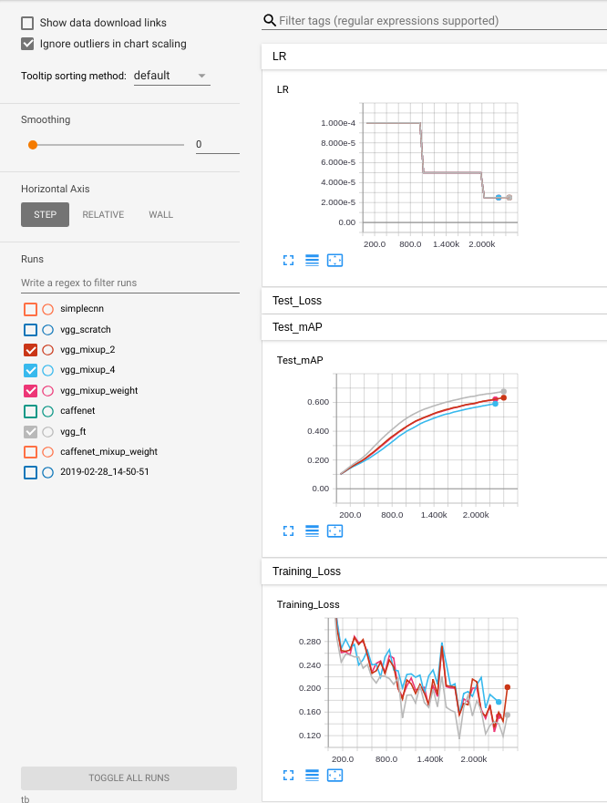

Baseline Test mAP - 0.6818  
Mixup Test mAP (best) - 0.633

A paper mentioned that mixup results are usually evident later during the training so I tried training CaffeNet from scratch using mixup from the beginning but didn't find the results too convincing. I did two experiments again - one without mixup on weights and one with. Here are the obtained curves.

Code implemented in `06_pascal_caffenet_mixup.py`.

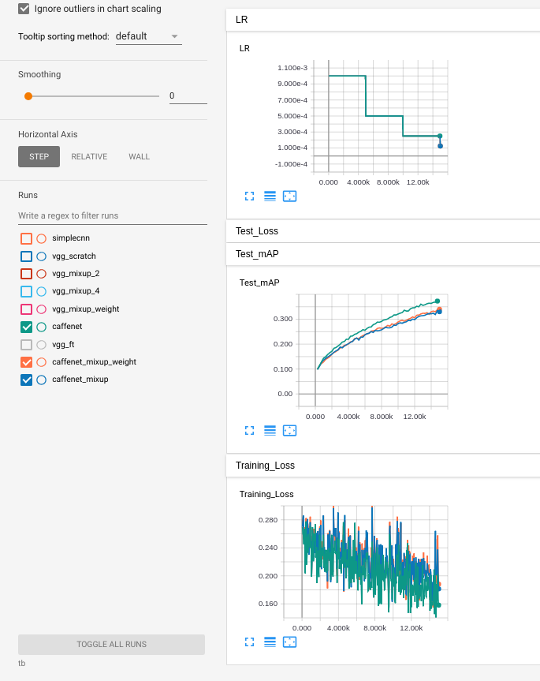

Baseline Test mAP - 0.3769  
Mixup Test mAP (best) - 0.34

